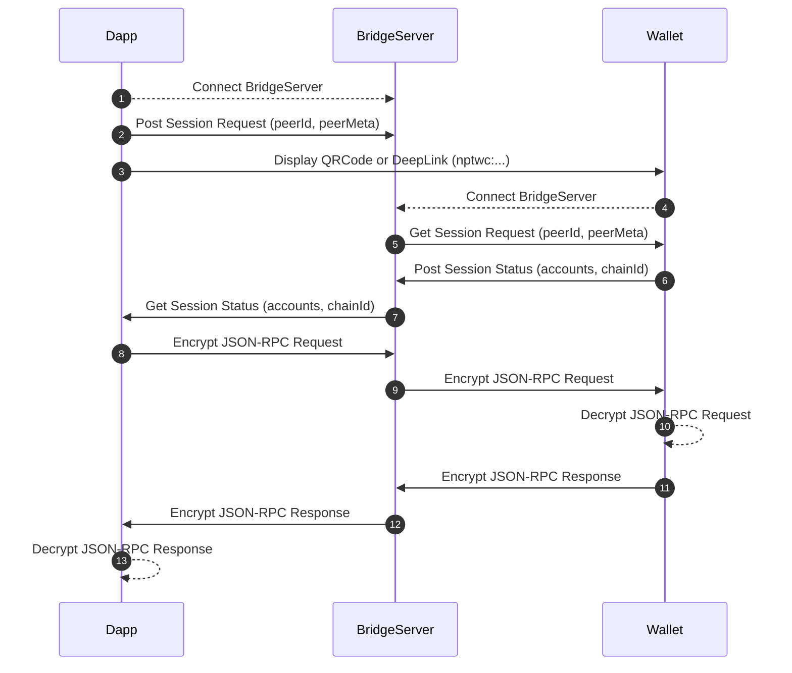

# Neopin Connect for [Android](https://github.com/Neopin/NeopinConnect-aos), [iOS](https://github.com/Neopin/NeopinConnect-iOS) and [Web](https://neopin.io)

NEOPIN Connect is a service to connect DApps and NEOPIN Wallet more easily and safely, and is implemented based on the Wallet Connect used in Ethereum.

NEOPIN Connect supports remote connections between App-to-App or Web-to-App using a Bridge server to relay payloads. These payloads are symmetrically encrypted and delivered securely using a shared key between the two peers. The connection between App-to-App or Web-to-App is initiated by a DApp running a deep link that contains a QR code or a standard URI and is established when the NEOPIN Wallet approves the connection request.

Currently, only Klaytn coins/tokens are supported, and it will be expanded to various chains such as Ethereum and BSC in the future.




# Documentation
To get started with [NeopinConnect](https://docs.neopin.io/enjoy-with-neopin/neopin-connect), please refer to the NeopinConnect documentation. This describes key concepts on NeopinConnect, from what they are for, their structure and common use cases.

# Requirements
- iOS 13
- Swift 5

    
# Dependencies

- [WalletConnect](https://github.com/WalletConnect/WalletConnectSwift)
- [web3swift](https://github.com/skywinder/web3swift)
- [CryptoSwift](https://github.com/krzyzanowskim/CryptoSwift)
    
# Installation

Add the pod to your Podfile:

```ruby
pod 'NeopinConnect'
```

And then run:
```
pod install
```

# License

NeopinConnect is available under the MIT license. See the LICENSE file for more info.

# Reference

- [WalletConnect Docs](https://docs.walletconnect.com/)
- [WalletConnectSwift SDK](https://github.com/WalletConnect/WalletConnectSwift)
